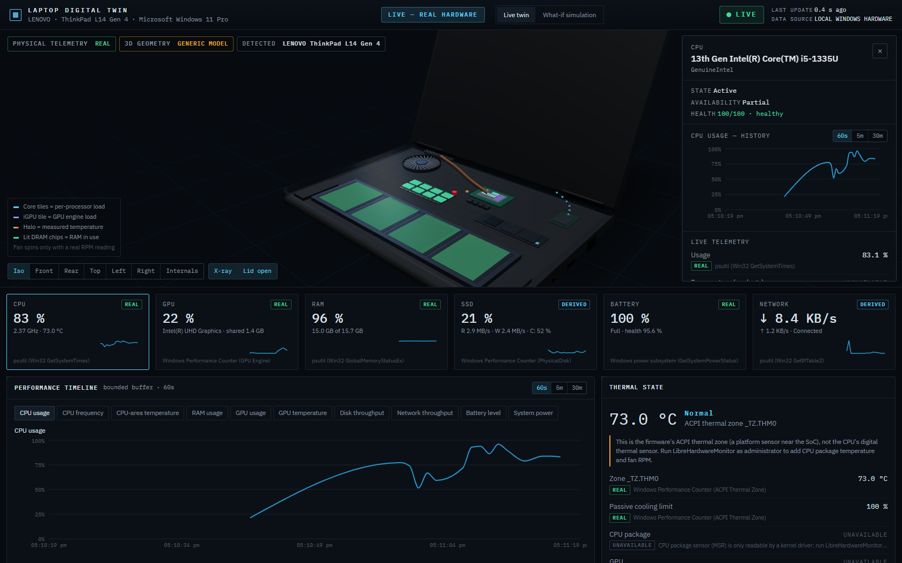
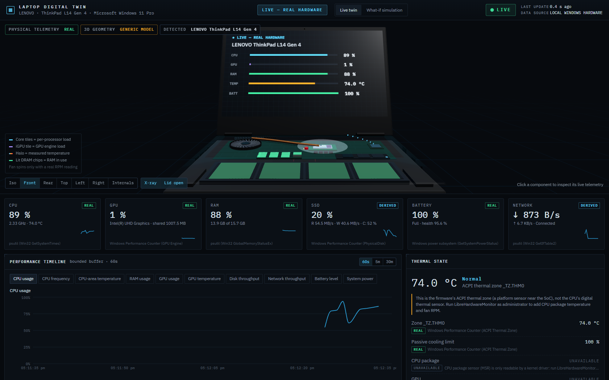
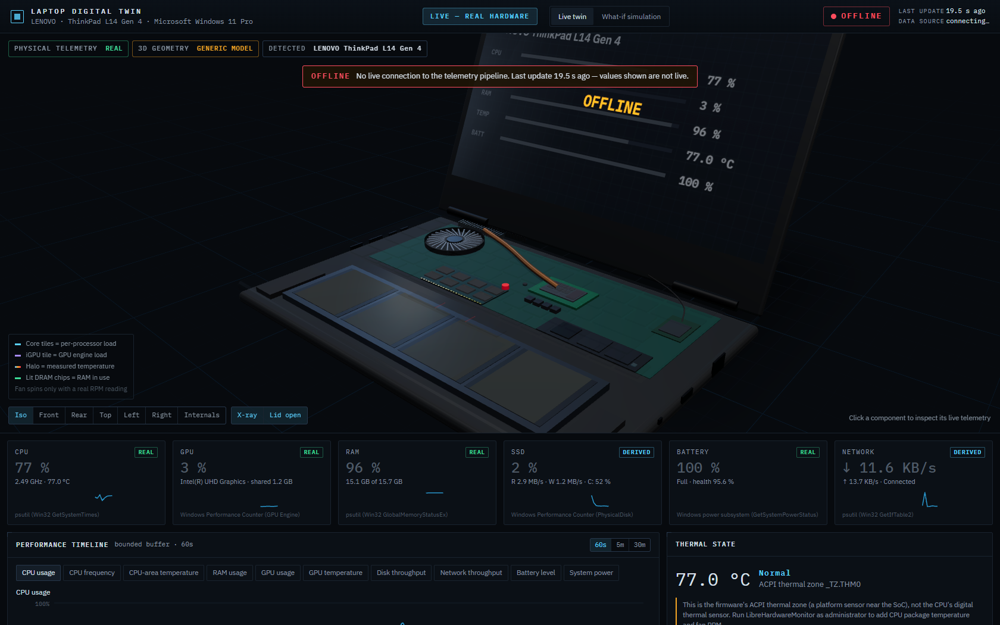
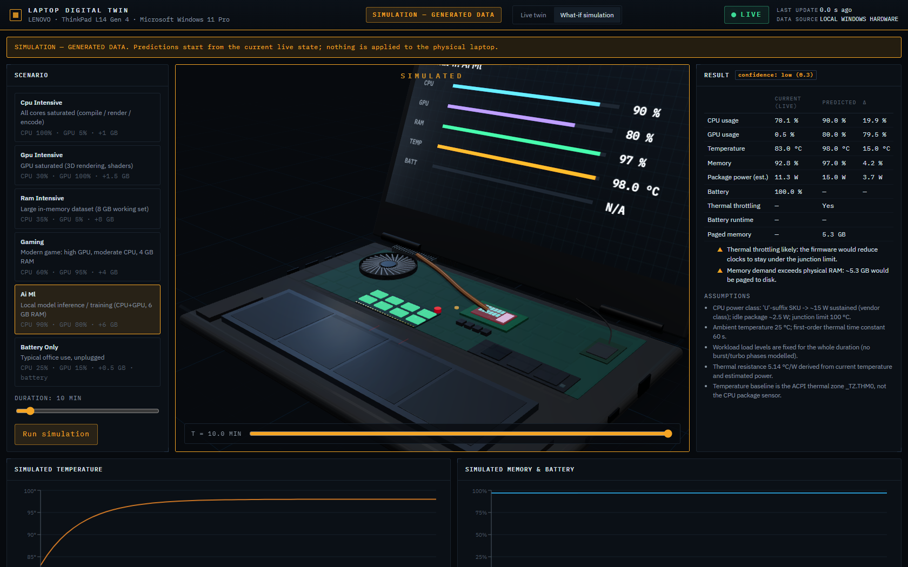

# Laptop Digital Twin

A real-time digital twin of the **physical Windows laptop it runs on**. A host agent reads real
telemetry from Windows hardware interfaces. A FastAPI backend keeps the twin's state, health,
anomalies and history. A React + Three.js app shows a 3D laptop driven by that telemetry.

```
MY ACTUAL LAPTOP → REAL HARDWARE TELEMETRY → REAL-TIME DIGITAL TWIN → 3D VISUALIZATION
                 → HEALTH → ANOMALIES → HISTORICAL DATA → PREDICTIVE ANALYTICS
```



**No fake data in LIVE mode.** Every live value carries its source (for example
`Windows Performance Counter (ACPI Thermal Zone)`), a quality flag and a kind (`measured` or
`derived`). If Windows does not expose a sensor, the UI shows **Unavailable** with the reason the
agent reported. The fan only spins when a real RPM reading exists. Generated data appears only in
the separate **SIMULATION** mode, which is labelled throughout.

## What it looks like

| Live twin (front view, screen shows the twin's own live readout) | Offline / stale handling |
|---|---|
|  |  |

| What-if simulation (generated data, clearly labelled) |
|---|
|  |

## Verified on this machine

Developed and verified on a **LENOVO ThinkPad L14 Gen 4** with an i5-1335U, 16 GB DDR4-3200,
Intel UHD graphics, a WD SN740 NVMe drive and a Sunwoda 46.5 Wh battery, running Windows 11 Pro
as a non-administrator user. See [docs/telemetry.md](docs/telemetry.md) for every metric, its
source, and what is REAL, DERIVED, UNAVAILABLE, PREDICTED or SIMULATED.

## Architecture (short)

```
Windows host                                  Docker (or native processes)
┌──────────────────────────┐   HTTPS/JSON    ┌───────────────────────────────────────┐
│ Telemetry agent (Python) │ ──────────────▶ │ FastAPI backend                       │
│  providers → normalizer  │  X-Agent-Key    │  DigitalTwinService (state, health,   │
│  → batch → store&forward │                 │  anomalies) → EventBus → WebSocket     │
└──────────────────────────┘                 │  ↘ Redis (hot state, pub/sub, buffer)  │
                                             │  ↘ PostgreSQL + TimescaleDB (history)  │
Browser ◀──── WebSocket /ws/twin + REST ──── │  React + Three.js frontend (nginx)    │
                                             └───────────────────────────────────────┘
```

The agent **must run on the host**: containers cannot read the host's performance counters, WMI,
ACPI or battery driver. Full design: [docs/architecture.md](docs/architecture.md).

## Prerequisites

- Windows 10/11, PowerShell
- Python 3.12+ (`py -3.12`), Node.js 22+, npm, Git
- Docker Desktop (for PostgreSQL/TimescaleDB and Redis; optional, see "Without Docker")

## Quick start (local development)

```powershell
# 1. Configure (once). Generate a random agent key and set the same value for agent and backend.
copy .env.example .env
python -c "import secrets; print(secrets.token_urlsafe(32))"   # paste into AGENT_INGEST_KEY
# also change POSTGRES_PASSWORD (and the matching password inside DATABASE_URL)

# 2. Infrastructure
docker compose up -d postgres redis

# 3. Backend
cd backend
py -3.12 -m venv .venv; .\.venv\Scripts\pip install -e ".[dev]"
.\.venv\Scripts\alembic upgrade head
.\.venv\Scripts\python -m app.main            # http://127.0.0.1:8000  (API docs: /docs)

# 4. Telemetry agent (new terminal, on the host)
cd agent
py -3.12 -m venv .venv; .\.venv\Scripts\pip install -e ".[dev]"
.\.venv\Scripts\python -m app.main --discover  # optional: print the detected hardware
.\.venv\Scripts\python -m app.main

# 5. Frontend (new terminal)
cd frontend
npm install
npm run dev                                     # http://127.0.0.1:5173
```

`scripts\dev.ps1` performs steps 2–5 in separate windows. `scripts\check.ps1` runs every lint,
type-check and test.

### Full stack in Docker (agent still on the host)

```powershell
docker compose up -d --build                    # postgres, redis, backend (:8000), frontend (:8088)
cd agent; .\.venv\Scripts\python -m app.main    # host agent posts to http://127.0.0.1:8000
```

Open http://127.0.0.1:8088. All ports are published on `127.0.0.1` only. Host ports are
configurable in `.env` (`POSTGRES_HOST_PORT=15432`, `REDIS_HOST_PORT=16379`,
`FRONTEND_HOST_PORT=8088`), so they don't clash with a locally installed PostgreSQL or Redis.

### Without Docker

Leave `DATABASE_URL` and `REDIS_URL` empty. The backend then runs with bounded in-memory history,
and `/health/ready` reports `database: disabled`. Live twin, health, anomalies and simulation all
work, but history is lost on restart.

## LIVE mode vs SIMULATION mode

| | LIVE mode (`Live twin` tab) | SIMULATION mode (`What-if simulation` tab) |
|---|---|---|
| Header | `LIVE — REAL HARDWARE` plus status pill | `SIMULATION — GENERATED DATA`, amber theme |
| Data | Real telemetry over the WebSocket | Deterministic model output from `POST /api/v1/simulation/run` |
| Store | `twinStore` / `seriesStore` | Local page state only; never written to the live stores |
| Effect on laptop | Read-only | None. Nothing is ever applied to the machine |

Status semantics: **LIVE** (update < 3 s old), **DEGRADED** (> 3 s), **STALE** (> 10 s),
**OFFLINE** (WebSocket lost or agent silent > 30 s). Old data is never shown as live.

## More sensors: CPU package temperature, fan RPM, GPU temperature

Windows does not expose CPU package temperature, fan tachometers or GPU temperatures to normal
users. To add them:

1. Install [LibreHardwareMonitor](https://github.com/LibreHardwareMonitor/LibreHardwareMonitor).
2. Run it **as administrator**. Then enable *Options → Remote Web Server → Run* (port 8085).
3. Keep `HARDWARE_SENSOR_PROVIDER=auto` (the default). The agent picks the sensors up within
   30 s, and the UI switches from "ACPI thermal zone" to "CPU package sensor".

The agent can also read LHM's WMI namespace `root\LibreHardwareMonitor` when that is published.

## Configuration

All settings are environment variables; see [.env.example](.env.example). Key ones: `APP_ENV`,
`API_HOST`, `API_PORT`, `DATABASE_URL`, `REDIS_URL`, `TELEMETRY_INTERVAL_MS`,
`HARDWARE_SENSOR_PROVIDER`, `LOG_LEVEL`, `CORS_ORIGINS`, `AUTH_MODE`, `API_KEYS`, `JWT_SECRET`,
`AGENT_INGEST_KEY`. `.env` is git-ignored.

## Quality gates

| Package | Lint | Types | Tests |
|---|---|---|---|
| agent | `ruff check` | `mypy --strict` | `pytest` (30 tests: providers incl. missing GPU/battery/sensors, permission denied, failure isolation, store-and-forward) |
| backend | `ruff check` | `mypy --strict` | `pytest` (48 unit/API/WebSocket/auth + 4 integration against real TimescaleDB/Redis) |
| frontend | `oxlint` | `tsc -b` (strict) | `vitest` (15: ring buffer, freshness, socket reconnect/backoff/watchdog, store, components) |

## Documentation

- [docs/architecture.md](docs/architecture.md): layers, data flow, domain model, event model, decisions
- [docs/telemetry.md](docs/telemetry.md): metric catalogue, sources, REAL/DERIVED/UNAVAILABLE/PREDICTED/SIMULATED, sensor compatibility, health and anomaly rules
- [docs/api.md](docs/api.md): REST and WebSocket reference
- [docs/security.md](docs/security.md): threat model, auth modes, privacy
- [docs/deployment.md](docs/deployment.md): production deployment, agent as a service, cloud adapters

## Production readiness, honestly

This is a solid, tested local-first application. Before calling a deployment production-ready:

- Enable `APP_ENV=production` (it enforces `AUTH_MODE` and strong keys).
- Put TLS in front of it.
- Run the agent as a service.
- Review [docs/security.md](docs/security.md).

Not built yet: user accounts and RBAC, multi-tenant isolation, cloud transport adapters (only the
interface exists), and ML-based (V3) anomaly detection. The last one is deliberate, see
[docs/telemetry.md](docs/telemetry.md).

## License

MIT. See [LICENSE](LICENSE).

## Accounts, operations and extended telemetry

* **User accounts** — `AUTH_MODE=accounts` (+ `JWT_SECRET` ≥ 32 chars). The first visit asks for the
  administrator account; admins add operators/viewers in *Settings → User accounts*. Optional
  `SETUP_TOKEN` protects first-run setup.
* **Workspaces** — group devices (*Settings → Workspaces*, sidebar switcher). Every agent that reports
  to this backend appears; a device belongs to one workspace.
* **Agent configuration from the UI** — telemetry interval, process cadence and the process-details
  opt-in are stored on the backend; the agent polls `/api/v1/agent/config` and applies changes within
  ~15 s, then reports what it actually runs with.
* **Extended telemetry (no admin rights)** — NVMe SMART health log (wear, temperature, spare,
  power-on hours, media errors), P/E-core topology, Secure Boot, TPM, WHEA hardware-error events,
  per-process start time, handles and open-socket counts.
* **LibreHardwareMonitor** — CPU package temperature/power, PL1/PL2, core voltage, GPU
  temperature/clock/power and fan RPM need LHM as administrator: run `scripts/install-lhm.ps1` from an
  elevated PowerShell.
* **Anomalies** — acknowledgements are persisted; each anomaly has a documented detection-confidence
  heuristic and a root-cause analysis (signal correlation + process attribution).
* **Analytics** — custom date ranges and previous-period comparison (`/telemetry/history?start&end`).
* **Simulation** — ambient temperature, thermal profile, fan-duty and charging estimates, 95 %
  temperature interval and runtime range.
* **Hub sync (off by default)** — forwards validated batches to another backend when an admin sets a
  target URL, enables it, and `SYNC_TARGET_KEY` is configured.
* **Diagnostics** — *Settings → Diagnostics bundle* downloads a redacted ZIP locally; nothing is uploaded.
* **Model assets** — admins upload a photo or `.glb` model of the laptop from *Hardware Inventory*.

## Endpoint agent (Phase 1)

The agent runs as a Windows service, independent of the browser: it collects hardware, OS, performance,
application and security-posture telemetry, caches it in a local SQLite queue, and synchronises with
the backend using a per-device token. Install from an elevated PowerShell with
`scripts\install-agent-service.ps1`. Architecture, the exact list of what leaves the laptop,
configuration, validation results and limitations: [docs/endpoint-agent.md](docs/endpoint-agent.md).

### Telemetry pipeline (Phase 2)

Agent → backend → dashboard is a single near-real-time pipeline:
- **Wire contract:** schema version 1.1.
- **Agent outbox:** priority-aware, with explicit backpressure; uploads are gzip bulk requests.
- **Idempotency:** durable (receipts plus unique event ids).
- **Sequences:** per-device gap and out-of-order tracking.
- **Presence:** heartbeat-driven ONLINE/STALE/OFFLINE/UNKNOWN.
- **WebSocket:** subscriptions per device, workspace or fleet.
- **Latency:** measured per stage.
- **Retention:** TimescaleDB raw data plus 5-minute aggregates, with configurable retention.

Design, API contract, failure behaviour, load-test results and limitations:
[docs/telemetry-pipeline.md](docs/telemetry-pipeline.md). Load test: `scripts/loadtest.py` (run it
against a separate backend and database).

### Digital twin state engine (Phase 3)

Each device has a stable, versioned digital twin. It is projected deterministically from telemetry:
normalized fields carry their own freshness, severity and provenance, alongside connectivity, health
rules and a timeline. Clients follow it through a REST snapshot plus WebSocket patches.

The UI adds:
- a fleet view (organization → department → employee → device) with server-side search, filters,
  sorting and pagination;
- a twin page with live state cards, mini-trends, "why this value?", health reasons, the timeline,
  and 3D severity / offline states;
- employee accounts that only see their own devices.

Rules, APIs, the WebSocket contract and measurements: [docs/digital-twin.md](docs/digital-twin.md).
